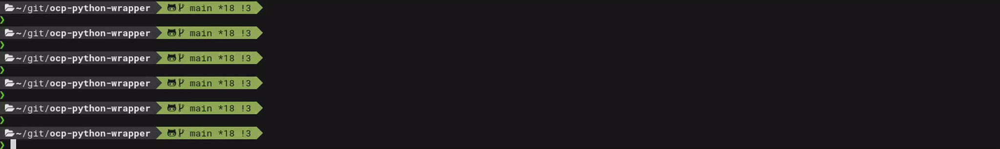

# openshift-python-wrapper (`wrapper`)
Pypi: [openshift-python-wrapper](https://pypi.org/project/openshift-python-wrapper)  
A python wrapper for [kubernetes-python-client](https://github.com/kubernetes-client/python) with support for [RedHat Container Virtualization](https://www.openshift.com/learn/topics/virtualization)  
Docs: [openshift-python-wrapper docs](https://openshift-python-wrapper.readthedocs.io/en/latest/)

The wrapper offers a simple and intuitive interface for interacting with the API.  
It standardizes how to work with cluster resources and offers unified resource CRUD (Create, Read, Update, and Delete) flows.  
The wrapper also provides additional capabilities, such as resource-specific functionality that otherwise needs to be implemented by users.  
The wrapper makes code easier to read and maintain over time.

One example of simplified usage is interacting with a container.  
Running a command inside a container requires using Kubernetes stream, handling errors, and more.  
The wrapper handles it all and provides simple and intuitive functionality.



Both developers or testers can use the wrapper.  The code is modular and easy to maintain.  
Instead of writing custom code for every API, you can use the wrapper that provides a consistent interface for interacting with APIs.  
It saves time, avoids code duplications, and reduces the chance of errors.

Using Python capabilities, context managers can provide out-of-the-box resource creation and deletion,  
and inheritance can be used to extend functionality for specific use cases.  
Pytest fixtures can utilize the code for setup and teardown, leaving no leftovers.  
Resources can even be saved for debugging.  
Resource manifests and logs can be easily collected.

## Installation
From source:
```bash
git clone https://github.com/RedHatQE/openshift-python-wrapper.git
cd openshift-python-wrapper
python setup.py install --user
```
From pypi:
```bash
pip install openshift-python-wrapper --user
```

## Release new version
### requirements:
* Export GitHub token
```bash
export GITHUB_TOKEN=<your_github_token>
```
* [release-it](https://github.com/release-it/release-it)
```bash
sudo npm install --global release-it
npm install --save-dev @release-it/bumper
```
### usage:
* Create a release, run from the relevant branch.  
To create a 4.11 release, run:
```bash
git checkout v4.11
git pull
release-it # Follow the instructions
```

## docs
Hosted on readthedocs.io [openshift-python-wrapper](https://openshift-python-wrapper.readthedocs.io/en/latest/)

## PR dependency
For PR dependency we use [dpulls](https://www.dpulls.com/)  
To make PR depends on other PR add `depends on #<PR NUMBER>` in the PR description.

## Logging configuration
To change log level export OPENSHIFT_PYTHON_WRAPPER_LOG_LEVEL:  

```bash
export OPENSHIFT_PYTHON_WRAPPER_LOG_LEVEL=<LOG_LEVEL> # can be: "DEBUG", "INFO", "WARNING", "ERROR", "CRITICAL"
```

## Code check
We use pre-commit for code check.
```bash
pre-commit install
```

Some code examples locate at [examples](examples) directory

## Contribute to the project
To contribute new additions or changes to the project, please refer to the [contribution guide](CONTRIBUTING.md) first.
